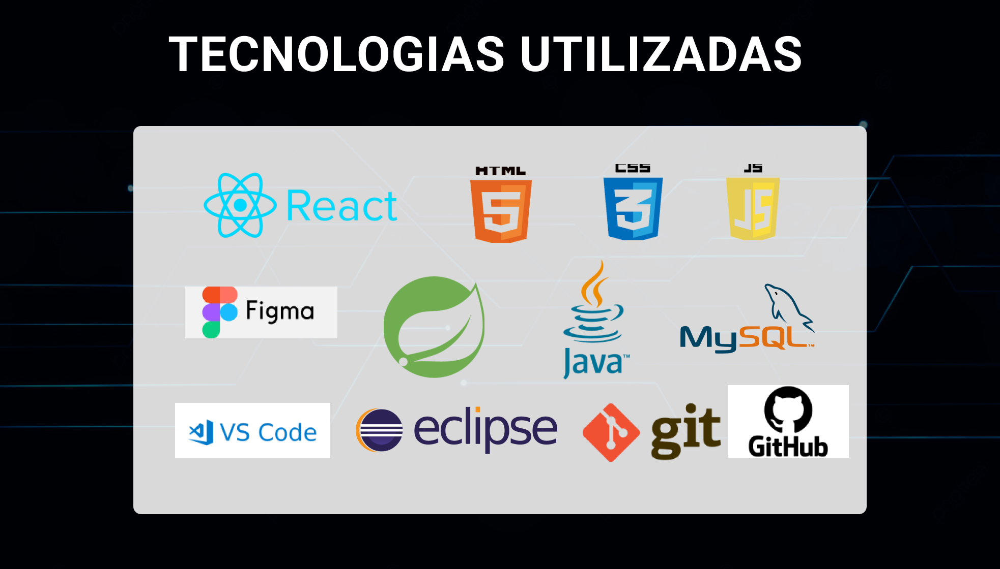
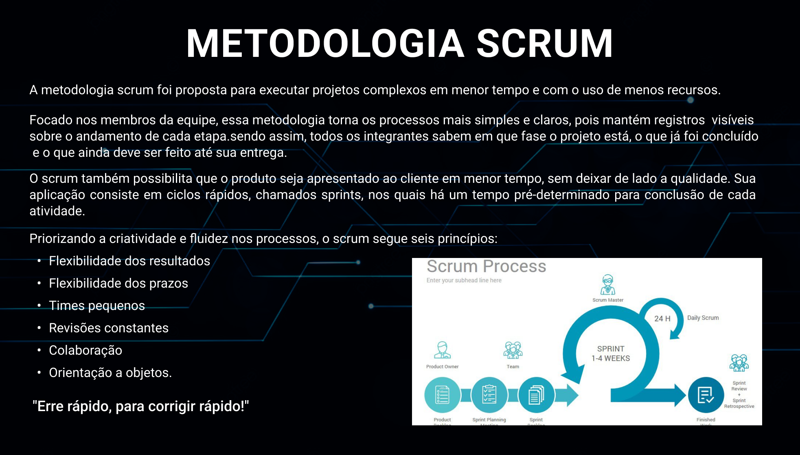

 
 

  <a href ="#bertoti"> Bertoti </a>  • 
  <a href ="#cadastroA"> Cadastro de conta de Água </a>  • 
  <a href ="#cadastroCA"> Cadastro de contrato de Água </a>  • 
  <a href ="#cadastroE"> Cadastro de contrato de Energia </a>  • 
  <a href ="#cronograma"> Cronograma das Sprints </a>  • 
  <a href ="#tecnologias-utilizadas">Tecnologias Utilizadas</a>  • 
  <a href ="#metodologia-utilizada">Metodologia Utilizada</a> 
 

 
 

# Bertoti
 Avaliação de intregração homem e maquina 

 
 

# Casdastro de conta de Agua 
Um dos requisitos do nosso cliente a Tecsus foi um cadastro de conta de água padronizado  
, assim o trabalho digitador vai ser mais rapido.

 
 
    
# Cadastro de contrato de Água
Cadastro de contrato de agua , com finalidade de agilizar de certa forma automatizar a digitação do digitador ao  
realizar um contrato de agua.

 
 

# Cadastro de contrato de Energia 
Cadastro de contrato de energia , com finalidade de agilizar e de certa forma automatizar a digitação do digitador ao  
realizar um contrato de energia.

 
 
## 📆 Cronograma das Sprints
-  [ Sprint 1 ]( ) - 25/03/2022 a 14/04/2022   
-  [ Sprint 2 ]( ) - 25/04/2022 a 15/05/2022  
-  [ Sprint 3 ]( ) - 16/05/2022 a 05/06/2022  
-  [Feira de Soluções](https://youtu.be/xGE51h8fBuY) - 15/06/2022

 
<h1 align="center"> 
</h1>

  

## 🖥️ Tecnologias Utilizadas
- **Front-end:** HTML, CSS, JavaScript, React;
- **Ferramentas:** Visual Studio Code, Figma, Git e Github;   

<h1 align="center"> 
</h1>
 

    

## 💡 Metodologia Utilizada   

- **Metodologia Ágil: SCRUM**
<h1 align="center"> 
</h1>
 

## 👨‍💻 Eu
<!-- 
 -->

 
Richard Rafael Sacramento soares  
Análise e Desenvolvimento de sistemas 3°semestre   
[@LinkedIn](https://www.linkedin.com/mwlite/in/richard-soares-002195221)                                   

 

